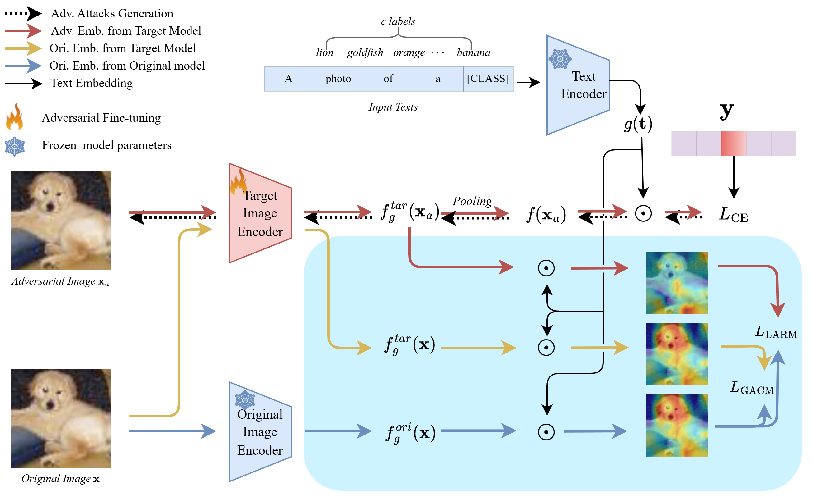
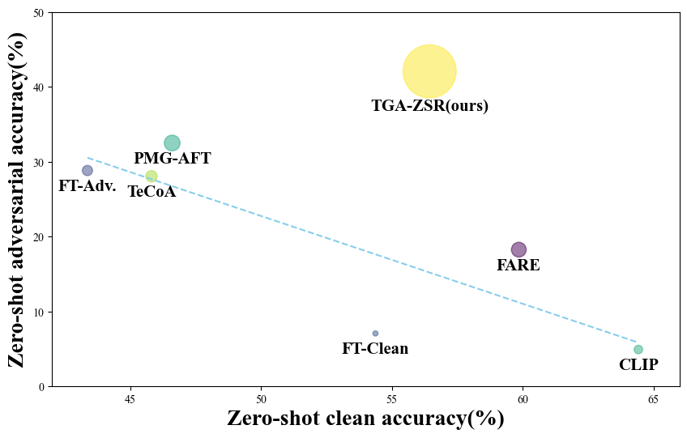
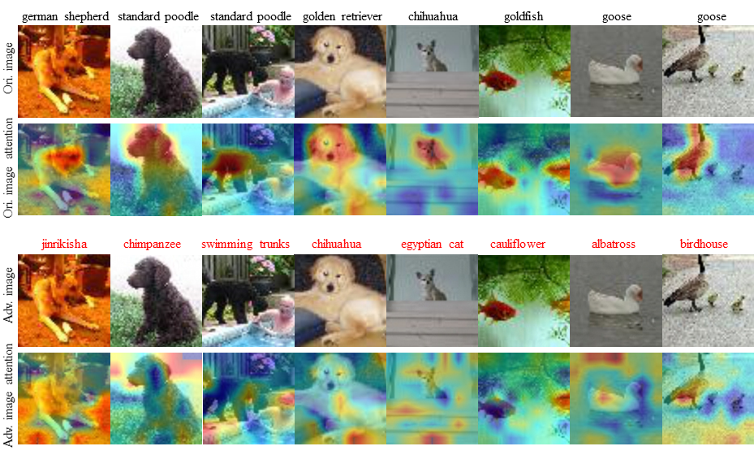

# Text-Guided Attention is All You Need for Zero-Shot Robustness in Vision-Language Models (NeurIPS 2024)

<p align="center">
  <p align="center" margin-bottom="0px">
    <a href="http://www.cs.columbia.edu/~mcz/"><strong>Lu Yu*</strong></a>
    ·
    <a href="https://www.scottgeng.com/"><strong>Haiyang Zhang*</strong></a>
    ·
    <a href="http://www.cs.columbia.edu/~junfeng/"><strong>Junfeng Yang</strong></a>
    </p>
    <p align="center" margin-top="0px"><a href="https://arxiv.org/abs/2212.07016">https://arxiv.org/abs/2212.07016</a></p>
</p>



  Despite showcasing unparalleled zero-shot capabilities, CLIP has garnered widespread attention and adoption across various domains, catalyzing extensive research endeavors. Nonetheless, CLIP has been observed to manifest relative susceptibility to adversarial examples, potentially rendering it exploitable by attackers against other models. So, our objective is to fortify CLIP's resilience against zero-shot adversarial attacks, leveraging its existing zero-shot proficiency. 
  Through empirical analyses, we have identified a phenomenon wherein adversarial perturbations induce shifts in text-guided attention. Building upon this revelation, we propose a simple yet effective attention refinement strategy: _Text-Guided Attention for Zero-Shot Robustness (TGA-ZSR)_, which aims at enhancing both the generalization and robustness of the CLIP model. TGA-ZSR consists of three parts: cross entropy module, attention refinement module and attention based model constrain module. The attention refinement module aligns the text-guided attention obtained from the target model via adversarial examples with the text-guided attention acquired from the original model via clean examples. This alignment enhances the model's robustness. Additionally, the attention-based model constraint module acquires text-guided attention from both the target and original models using clean examples. Its objective is to maintain model performance on clean samples while enhancing overall robustness. Subsequently, an extensive array of experiments validates that our method yields a 9.45\% enhancement in zero-shot robust accuracy over the current state-of-the-art techniques.

## Zero-Shot Adversarial Robustness Challenge

| Defence Method 	| Submitted By    	| Accuracy<br>(Robust) | Accuracy<br>(Clean) 	  | Accuracy<br>(Average) |
|----------------	|-----------------	|----------------	|-----------------	|-----------------	|
| <a href="https://github.com/openai/CLIP">CLIP</a> | PMLR 2021 |  4.90% | 64.42% | 34.66% |
|                      FT-Clean             | (initial entry) 	|  7.05% | 54.37% | 30.71% |
|                       FT-Adv.           | (initial entry) 	| 28.83% | 43.36% | 36.09% |
|<a href="https://github.com/cvlab-columbia/ZSRobust4FoundationModel">TeCoA</a> | ICML 2023 | 28.06% | 45.81% | 36.93% |
|<a href="https://github.com/serendipity1122/Pre-trained-Model-Guided-Fine-Tuning-for-Zero-Shot-Adversarial-Robustness">PMG-AFT</a> | CVPR 2024 | 32.51% | 46.60% | 39.55% | 
|<a href="https://github.com/chs20/RobustVLM">FARE</a> | CVPR 2024 	| 18.25% | 59.85% | 39.05% |   
|                  Vision-based              | (initial entry) 	| 29.47% | 45.02% | 37.24% |
|                    TGA-ZSR                | (initial entry) 	| 41.96% | 59.48% | 49.22% |


If you obtain better results, you are welcome to update your results here by sending email or push request.

## CLIP Model

### Environment setup:

install virtual environment:
```
pip install virtualenv
virtualenv TGA-ZSR
source TGA-ZSR/venv/bin/activate
pip install -r requirement.txt
```
Then replace the files in the replace folder to the source code in your environmet:  


### Experiment:
Through experimentation, it was observed that the attention mechanism guided by the text in the adversarial example had shifted.


Run the code with (<a href="https://github.com/cvlab-columbia/ZSRobust4FoundationModel">TeCoA</a> and <a href="https://github.com/serendipity1122/Pre-trained-Model-Guided-Fine-Tuning-for-Zero-Shot-Adversarial-Robustness">PMG-AFT</a> see source code.):
```
bash ./main.sh
```
options for each of the code parts :
* `--Method`: Differentiate between checkpoints obtained using various methods.
* `--train_eps`: The magnitude of the perturbation applied to generate the training adversarial example. (default = 1)
* `--train_numsteps`: The number of iteration applied to generate the training adversarial example. (default = 2)
* `--train_stepsize`: The iteration step size applied to generate the training adversarial example. (default = 1)
* `--test_eps`: The magnitude of the perturbation applied to generate the test adversarial example. (default = 1)
* `--test_numsteps`: The number of iteration applied to generate the test adversarial example. (default = 100)
* `--test_stepsize`: The iteration step size applied to generate the test adversarial example. (default = 1)
* `--arch`: Different CLIP versions. (default = 'vit_b32')
* `--dataset`: The dataset used for training. (default = 'tinyImageNet')
* `--seed`: random seed. (default = 0)
* `--resume`: Address of checkpoint. (default = None)
* `--last_num_ft`: fine tuning layer (default = 0)
* `--VPbaseline`: Whether adversarial training is conducted or not.

and specific options for each of TGA-ZSR.py:
  
* `--Distance_metric`: Select the distance measure in the loss function. (default = 'l2')
* `--atten_methods`: Attention from different perspectives. (default = 'text')
* `--Alpha`: L_AR in Equ.6. (default = 0.08)
* `--Beta`: L_AMC in Equ.7. (default = 0.05)

