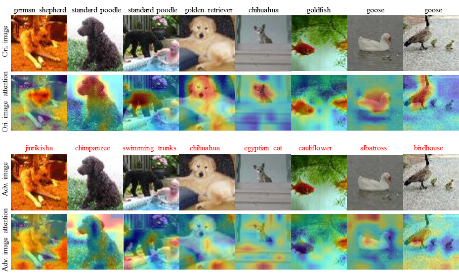
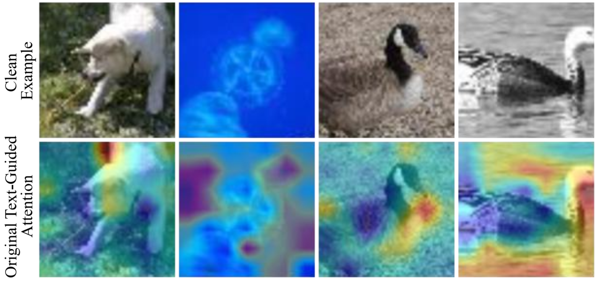
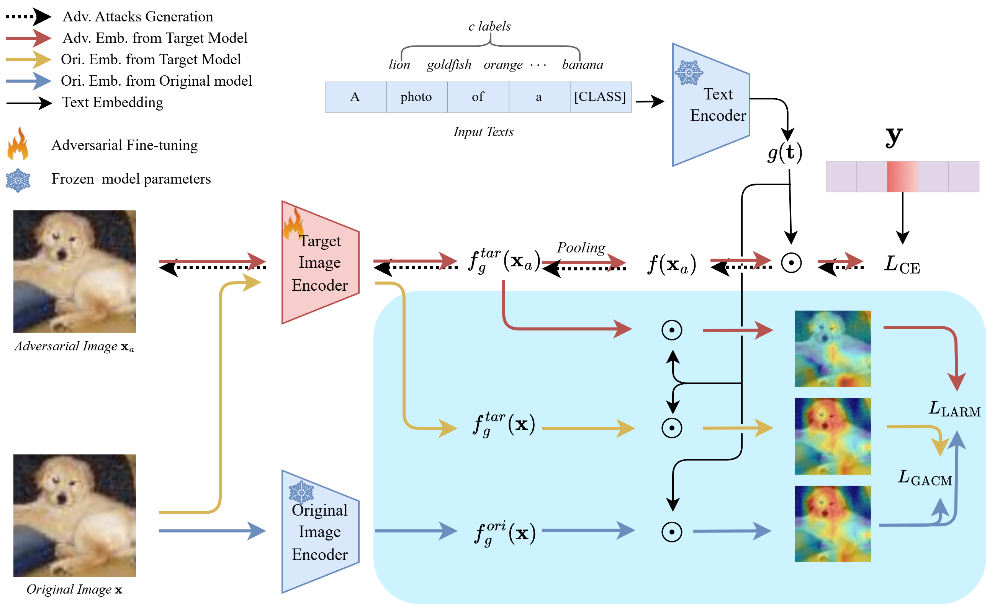
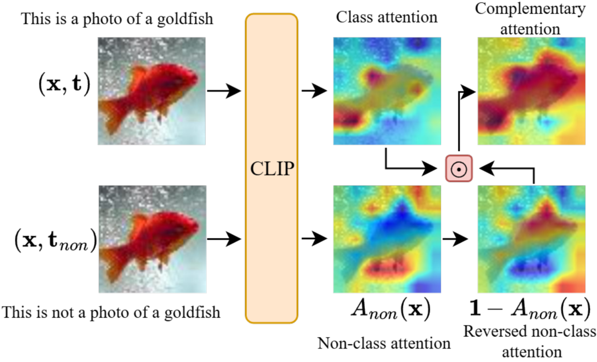
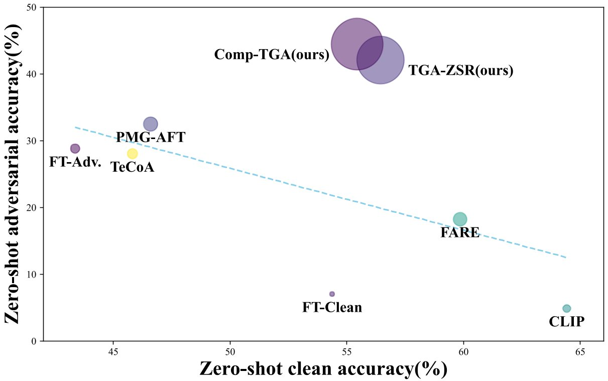

<p align="center">

# Complementary Text-Guided Attention for Zero-Shot Adversarial Robustness  
### 🚀 TPAMI 2026  &nbsp;&nbsp;&nbsp;&nbsp;&nbsp;&nbsp;&nbsp;&nbsp;&nbsp;&nbsp;&nbsp;&nbsp; **Lu Yu · Haiyang Zhang · Changsheng Xu** &nbsp;&nbsp;&nbsp;&nbsp;&nbsp;&nbsp;&nbsp;&nbsp;&nbsp;&nbsp;&nbsp;&nbsp; <a href="">📄 TPAMI 2026 Paper (arXiv)</a>

<br><br>

# Text-Guided Attention is All You Need for Zero-Shot Robustness in Vision-Language Models  
### 🎯 NeurIPS 2024 &nbsp;&nbsp;&nbsp;&nbsp;&nbsp;&nbsp;&nbsp;&nbsp;&nbsp;&nbsp;&nbsp;&nbsp; **Lu Yu · Haiyang Zhang · Changsheng Xu** &nbsp;&nbsp;&nbsp;&nbsp;&nbsp;&nbsp;&nbsp;&nbsp;&nbsp;&nbsp;&nbsp;&nbsp; <a href="https://arxiv.org/abs/2410.21802">📄 NeurIPS 2024 Paper (arXiv)</a>
</p>

---

## 🔍 Overview

Pretrained vision-language models such as [CLIP](https://github.com/openai/CLIP) demonstrate remarkable zero-shot generalization ability. However, they remain highly vulnerable to adversarial perturbations.

We identify a critical phenomenon:

> Adversarial perturbations systematically shift **text-guided attention**, rather than merely corrupting pixel space.

Based on this insight, we propose:

- **TGA-ZSR** (NeurIPS 2024)  
  *Text-Guided Attention for Zero-Shot Robustness*

- **Comp-TGA** (TPAMI 2026)  
  *Complementary Text-Guided Attention*

Across 16 datasets, our methods improve zero-shot robust accuracy by:

- **+9.58%** with TGA-ZSR  
- **+11.95%** with Comp-TGA  

---

## 🧠 Motivation

### Attention Shift Under Adversarial Perturbation

Adversarial examples induce significant deviation in text-guided attention.

<p align="center">

</p>

---

### Spurious Attention in Clean Samples

Even without adversarial perturbations, text-guided attention may focus on irrelevant regions.

<p align="center">
  
</p>

---

## 🚀 Method

### TGA-ZSR Framework

<p align="center">

</p>

TGA-ZSR consists of two components:

**Local Attention Refinement Module**  
Aligns adversarial attention with clean attention from the original model.

**Global Attention Constraint Module**  
Preserves clean performance while enhancing robustness.

This design enforces attention consistency without sacrificing zero-shot generalization.

---

### Complementary Text-Guided Attention (Comp-TGA)

<p align="center">

</p>

We observe that standard text-guided attention occasionally captures spurious foreground cues.

Comp-TGA introduces a complementary fusion mechanism:

- Class-prompt guided foreground attention  
- Reversed non-class prompt driven attention  

By integrating these two complementary signals, the model captures a more accurate foreground representation and improves robustness stability.

---

## 📊 Zero-Shot Adversarial Robustness Benchmark

| Method | Venue | Robust | Clean | Average |
|--------|--------|--------|--------|--------|
| CLIP | ICML 2021 | 4.90 | 64.42 | 34.66 |
| FT-Clean | Initial Entry | 7.05 | 54.37 | 30.71 |
| FT-Adv. | Initial Entry | 28.83 | 43.36 | 36.09 |
| TeCoA | ICLR 2023 | 28.06 | 45.81 | 36.93 |
| PMG-AFT | CVPR 2024 | 32.51 | 46.60 | 39.55 |
| FARE | ICML 2024 | 18.25 | 59.85 | 39.05 |
| Vision-based | Initial Entry | 29.47 | 45.02 | 37.24 |
| **TGA-ZSR (Ours)** | NeurIPS 2024 | **42.09** | 56.44 | 49.27 |
| **Comp-TGA (Ours)** | TPAMI 2026 | **44.46** | 55.44 | **49.95** |

---

### Robustness–Clean Trade-off

<p align="center">

</p>

Each point represents a method.  
Point size reflects trade-off quality between clean and robust accuracy.

---

## 🔧 Reproducibility

### Checkpoints

- [TGA-ZSR](https://drive.google.com/drive/folders/1T7APhNq3tRW81vC1Lx8JSbHxWuP7euSx?usp=drive_link)  
- [Comp-TGA](https://drive.google.com/drive/folders/1cvqDha1useGdCgTjGatZMuBj1W71nMyk?usp=drive_link)

---

## ⚙️ Environment Setup

```bash
pip install virtualenv
virtualenv TGA-ZSR
source TGA-ZSR/venv/bin/activate
pip install -r requirements.txt
```


### Experiment:
Run the code with (<a href="https://github.com/cvlab-columbia/ZSRobust4FoundationModel">TeCoA</a> and <a href="https://github.com/serendipity1122/Pre-trained-Model-Guided-Fine-Tuning-for-Zero-Shot-Adversarial-Robustness">PMG-AFT</a> see source code.):
```
bash ./main.sh
```
options for each of the code parts :
* `--Method`: Differentiate between checkpoints obtained using various methods.
* `--train_eps`: The magnitude of the perturbation applied to generate the training adversarial example. (default = 1)
* `--train_numsteps`: The number of iteration applied to generate the training adversarial example. (default = 2)
* `--train_stepsize`: The iteration step size applied to generate the training adversarial example. (default = 1)
* `--test_eps`: The magnitude of the perturbation applied to generate the test adversarial example. (default = 1)
* `--test_numsteps`: The number of iteration applied to generate the test adversarial example. (default = 100)
* `--test_stepsize`: The iteration step size applied to generate the test adversarial example. (default = 1)
* `--arch`: Different CLIP versions. (default = 'vit_b32')
* `--dataset`: The dataset used for training. (default = 'tinyImageNet')
* `--seed`: random seed. (default = 0)
* `--resume`: Address of checkpoint. (default = None)
* `--last_num_ft`: fine tuning layer (default = 0)
* `--VPbaseline`: Whether adversarial training is conducted or not.

Specific Options ：

TGA-ZSR.py
* `--Distance_metric`: Select the distance measure in the loss function. (default = 'l2')
* `--atten_methods`: Attention from different perspectives. (default = 'text')
* `--Alpha`: L_AR in Equ.9. (default = 0.08)
* `--Beta`: L_AMC in Equ.12. (default = 0.05)

Comp-TGA.py: 
* `--Distance_metric`: Select the distance measure in the loss function. (default = 'l2')
* `--atten_methods`: Attention from different perspectives. (default = 'text')
* `--Alpha`: L_AR in Equ.9. (default = 0.10)
* `--Beta`: L_AMC in Equ.12. (default = 0.07)

## Citation
If you find this repository useful, please consider citing our paper:
```bibtex
@inproceedings{
TGA-ZSR,
title={Text-Guided Attention is All You Need for Zero-Shot Robustness in Vision-Language Models},
author={Yu, Lu and Zhang, Haiyang and Xu, Changsheng},
booktitle={The Thirty-eighth Annual Conference on Neural Information Processing Systems},
year={2024},
}
```

## Acknowledgement
We gratefully thank the authors from [TeCoA](https://github.com/cvlab-columbia/ZSRobust4FoundationModel) and [CLIPCAM](https://github.com/aiiu-lab/CLIPCAM) for open-sourcing their code.
